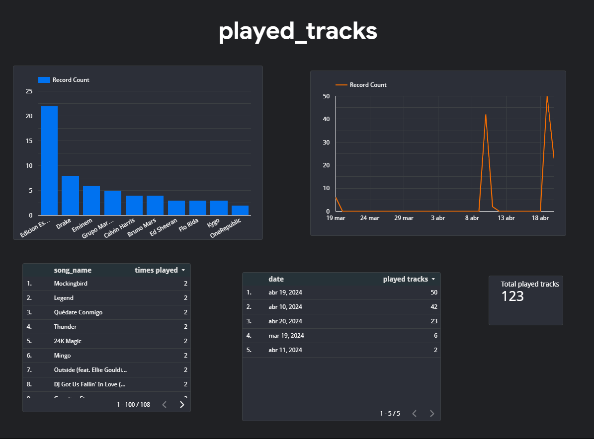

# Spotify Recently Played Tracks

## Overview
This project uses the Spotify API to retrieve the recently played songs of a user and processes this data for further analysis. The retrieved song data is then ingested into Google BigQuery, a fully-managed, serverless data warehouse, for storage and querying. Finally, the project utilizes Looker Studio, a data visualization and business intelligence platform, to create insightful visualizations and dashboards for analyzing the music listening habits of users.

By combining Docker, Python, BigQuery, and Looker Studio, this project offers a streamlined solution for data engineering tasks related to music consumption analysis. 

## Features
- Integration with Spotify API to fetch recent played songs
- Data ingestion into BigQuery
- Visualization using Looker Studio

## Prerequisites
- Docker installed on your machine
- BigQuery account and credentials
- Looker Studio account

## Setup
1. Clone the repository:
   ```
   git clone https://github.com/JovanRL/spotify-recently-played-tracks.git
   ```
2. Get your Spotify credentials
- Go to https://developer.spotify.com/dashboard
- Click on Create app
- Fill the fields (In the Redirect URI part, just provide this website: https://spotify-etl.netlify.app/)
- Go to your app -> Settings
- Copy your CLIENT_ID and CLIENT_SECRET

3. Create a project and DB for BigQuery
- Go to https://console.cloud.google.com/
- Select BigQuery
- Create a project
- Create a dataset

4. Grant permissions for your BigQuery project
- Go to IAM & Admin
- Select your project
- Grant "BigQuery Data Owner" or "BigQuery User" permissions 

5. Get your key for BigQuery
- Go to service accounts and create one
- Select the account and go to "KEYS"
- Click on "ADD  KEY", select JSON and create

6. Environment Variables

To run this project, you will need to add the following environment variables to the Dockerfile with your information

`CLIENT_ID`

`CLIENT_SECRET`

`REDIRECT_URI`

`GOOGLE_APPLICATION_CREDENTIALS` (It´s the name of your BigQuery  key)

`DB_ID` (Go to BigQuery, go to the Explorer panel, select your project, select your dataset and copy the Dataset ID)

7. Creating Docker image
- To create an image, copy and paste the following command in your terminal:
   ```
   docker image build --tag spotify-etl .
   ```

## Usage
1. Running the container
- To run the container, copy and paste this command in your terminal:
   ```
   docker container run  -it spotify-etl
   ```
2. Getting the code
- Once you run the container, it will ask you to go to the website you provided. Copy everything in the URL right to the word code=

3. Paste the code, hit enter and you will see your recently played songs (Although, this is just for debugging purposes)

4. Go to BigQuery and query your table

5. Select "Explore Data" -> "Explore with Looker Studio"

6. Now, it's up to you what graphs you want to show

## Results


## Limitations
- The Spotify API only gives you the last 50 played songs
- This is not a realtime pipeline, so you will have to run the container everytime you want to upload new data
